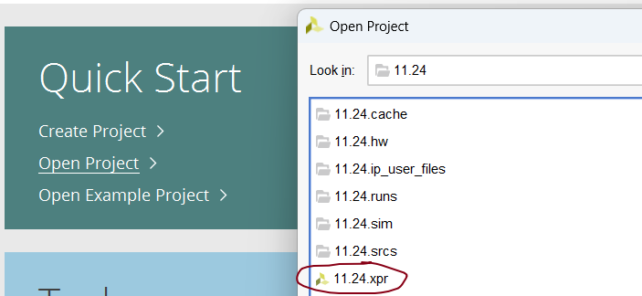

# step 1
    download the package "11.24"\"11.24.2"\"11.24.3"
# step 2
    using the vivado open the .xpr file
    

In the 11.24 folder is the first task: Rectangle Transform

In the 11.24.2 folder is the second task: Snakes

In the 11.24.3 folder is the third task: Simple implementation of ROM